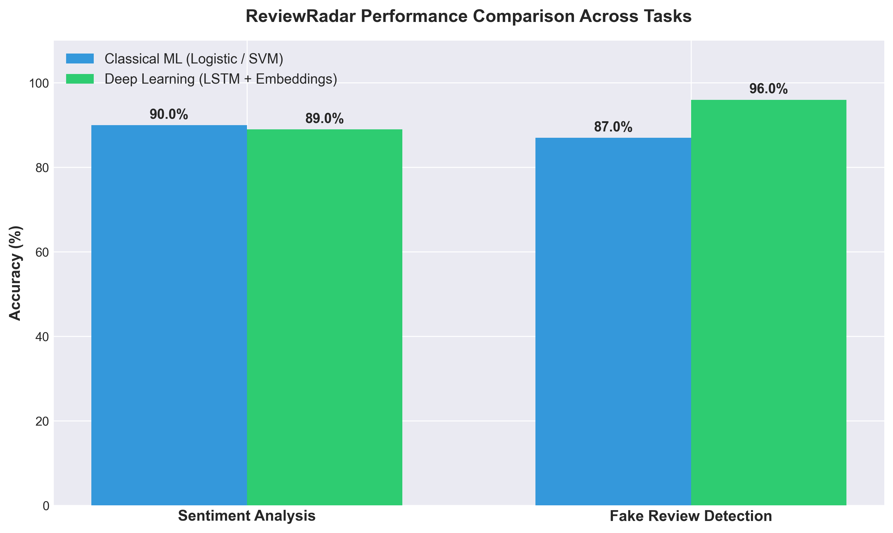

# Model Performance Results

Evaluation results for **Sentiment Analysis** and **Fake Review Detection** models evaluated on Amazon and synthetic review benchmark datasets.

## Benchmark Results Table

| Task | Model Architecture | Features / Embeddings | Dataset Size | Accuracy |
| :--- | :--- | :--- | :--- | :--- |
| **Sentiment Analysis** | Logistic Regression | Bag-of-Words / TF-IDF | 47,000+ Amazon Reviews | **90%** |
| **Sentiment Analysis** | Deep Neural Network / LSTM | GloVe / Word2Vec | 47,000+ Amazon Reviews | **89%** |
| **Fake Review Detection** | Support Vector Machine (SVM) | Bag-of-Words / N-grams | 40,000+ Labeled Reviews | **87%** |
| **Fake Review Detection** | Bidirectional LSTM | Sequential Embeddings | 40,000+ Labeled Reviews | **96%** |

## Visual Summary

